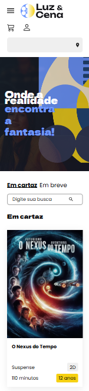
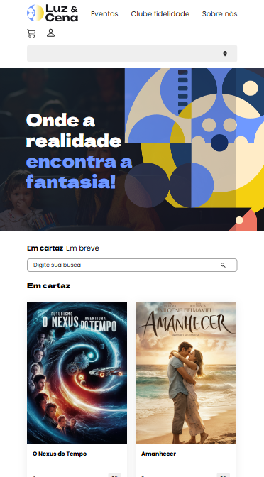
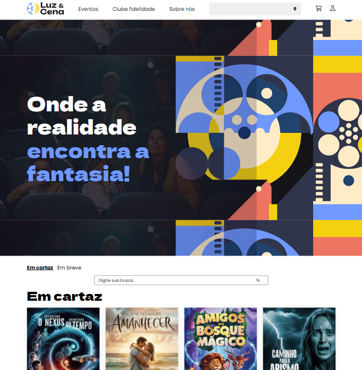

# Luz e Cena - Landing Page

## 🎬 Sobre o Projeto

Esta é uma landing page para um cinema fictício chamado "Luz e Cena". O projeto foi desenvolvido como parte da formação **"CSS avançado: implementando grid, flexbox e Sass"** da [Alura](https://www.alura.com.br/), com o objetivo de aplicar conceitos modernos de layout e estilização para criar uma interface web responsiva e elegante.

O foco principal da estilização foi o uso extensivo de **CSS Flexbox** para criar layouts fluidos, adaptáveis e de fácil manutenção, garantindo uma ótima experiência de usuário em diferentes dispositivos.

## 🎨 Preview do Projeto
| Versão Mobile | Versão Tablet | Versão Desktop
| :---: | :---: | :---: |
|  |  |  |

## ✨ Funcionalidades e Conceitos de CSS Flexbox Utilizados
### Principais Aplicações do Flexbox:
*  **Header e Navegação**
*  **Galeria de Filmes em Cartaz**
*  **Layout do Rodapé**
*  **Formulário da Newsletter**
*  **Alinhamento de Conteúdo**
